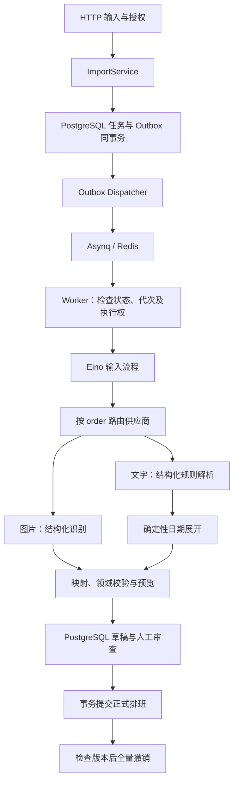

# AI 导入重开发 Spec

版本：v0.4，2026-10-02。状态：正式实现已落地，自动化及真实模型主链路已验收；部署边界见 `docs/testing/ai-eino-acceptance-2026-10-02.md`。

## 1. 授权范围与文档关系

2026-10-02 用户已授权正式执行本 Spec，包括业务后端、前端、结构同步与 Worker 重构。仍未授权提交或推送 Git；验证使用隔离测试数据。

后续开发范围为 AI 图片导入与文字生成排班的完整链路：输入、供应商适配、路由、错误、异步任务、重试、取消、恢复、诊断、预览、人工修改、提交和撤销。Excel 共享审查、提交、撤销能力，因此共同的权限、版本和领域校验也须回归；不重新开发无关业务。

本 Spec 的目标设计覆盖 `.agent/REQUIREMENTS.md` 中旧 tRPC-Agent-Go 技术选择及 `.agent/ENGINEERING.md` 中旧 PostgreSQL 队列／ants 运行方式。其他数据范围、权限、全局排班、快照及事务约束继续遵循 `.agent/DATA_SCOPES.md` 和工程约束。目标不得被描述为已实现；正式开发完成后再同步项目级文档。

## 2. 已确认决定

- 使用 Eino；正式 AI 链路替换 tRPC-Agent-Go。
- 使用 Asynq（不是 asyncq）及 Redis 管理异步调度；PostgreSQL 保存业务事实。
- API 仍为唯一长期运行入口，内嵌 Asynq Worker；不新增独立 Worker 部署。
- Asynq 管理任务并发，不在其 Handler 外叠加 ants。
- 支持图片导入与自然语言描述；均只生成草稿，由用户审核后提交。
- 供应商顺序为字节、OpenAI Chat Completions 中转站、DeepSeek 官方 API。
- 用户已要求移除 StepFun，后续配置和验收不包含该供应商
- 每个供应商模型实例有唯一 `id` 和正整数 `order`，数值越小越优先；重复优先级拒绝加载。
- 支持正常停机、重启、进程崩溃和暂态网络故障；不实现 Redis 极端数据丢失后的自动队列重建。
- 保留事务 Outbox、业务幂等与执行隔离。Redis 正常重启和重复投递仍需要这些机制。

## 3. 当前入口与事实

后端 `shiftory-server/cmd/api` 装配 `internal/ai` Eino Workflow、`internal/importer/imageai` 合同与 `internal/importjob` Asynq／Outbox。图片通过 `POST /api/v1/workspaces/{workspaceId}/imports/image` 创建单成员任务。图片结果和 Excel 共用预览、决策、修正、提交及回滚接口。

正式排班按 `(user_id, work_date)` 全局唯一。导入任务、成员选择、班次映射和授权仍属于工作区；不能借此扩展为无工作区导入。个人排班的 `/me/schedules` 全局范围继续有效。

后端加载器已支持供应商数组和 routing、redis、tasks。正式 API 读取 development.yaml；独立联网测试读取 ai.development.yaml，不自动合并。实际 AI 配置已合并入本地开发配置，配置变更在重启后生效。

## 4. 架构与边界

Eino 类型限制在适配／编排层，领域服务依赖项目自有的 `RecognitionInput`、`RuleSet`、`RecognitionResult`、`ProcessingError`。流程启动时编译，各次执行隔离消息及中间结果，不启用跨任务会话或工具调用，不赋予模型数据库写权限。

## 5. 输入合同

### 5.1 公共输入

由后端授权的 `workspaceId`、`targetUserId`、`startDate`、`endDate`，日期区间最多 366 天；目标成员不可由模型推断。输入保存工作区 IANA 时区、班次及别名快照、用户提示和实际解析基准时间。运行时间戳使用 UTC。

任务创建使用 `Idempotency-Key`。相同作用域、键和输入指纹返回原任务；同键不同输入返回 409。指纹包含输入类型、内容哈希、日期、目标、提示及映射。文件与数据库不在同事务，保存失败补偿删除使用独立且有界的上下文；提交结果未知时先核对任务是否存在，再决定删除文件。

### 5.2 图片

单图片、单成员；10 MiB／2500 万像素上限，PNG/JPEG/WebP/GIF。按内容验证格式、尺寸和 MIME。处理方向信息；GIF 第一帧策略需告知用户，不静默裁剪。保存原图及哈希。用户提示最多 2000 字、映射提示最多 100 条，班次提示必须在工作区内唯一解析。

### 5.3 文字

新增描述输入，最多 10000 字，目标和日期区间仍需明确选择。支持星期范围、多时间段、明确休息、指定日期覆盖、连续区间、带起始锚点的周期轮班及已定义班次引用。

“下个月”等相对日期使用工作区时区和提交时刻确定并展示，在创建时固定，重试不得漂移。描述与选定区间矛盾时要求澄清；模型不可静默改变目标或区间。未描述日期为 MISSING，不自动推断周末或节假日休息。首版无内置法定假日日历，相关描述必须补充具体日期或给出待确认事项。

## 6. 文字规则合同与日期展开

AI 输出 `RuleSet`，不直接枚举整个区间。规则结构包含 `schemaVersion`、`period`、`rules`、`issues`；每条规则有唯一 `id`、`type`、`status`、`segments`、`note`，条件字段如下。

| type | 条件字段 | 含义 |
| --- | --- | --- |
| WEEKLY | weekdays：ISO 星期 1–7；可选子区间 | 按星期重复 |
| DATE_RANGE | start/end | 明确连续日期 |
| DATE | date | 单日期例外 |
| CYCLE | anchorDate、cycleDays、dayOffsets | 以锚点及周期偏移重复；跨月延续 |

segments 使用统一 SHIFT／TIME_RANGE 合同；CYCLE 同一状态／时间段一条规则，不同周期日使用其他规则表达。偏移必须在 `[0, cycleDays)`，使用日历 AddDate 展开，不使用固定 24 小时计算日期。

特定 DATE 高于 DATE_RANGE，DATE_RANGE 高于 WEEKLY／CYCLE。相同优先级的相同结果可合并，不同结果标记 UNCERTAIN；存在明确“取消／替换”语义时输出可校验的替代关系，不用文本出现先后猜测覆盖。未覆盖的周期日也为 MISSING，除非描述明确安排休息。无锚点周期、含糊星期、未知班次、含糊跨日均进入待确认。

程序按已验证规则展开逐日草稿，保留 `ruleIds` 作为来源。用户看到原描述、规则摘要、例外、疑问和逐日结果。修改描述后重新生成创建关联的新任务，保留旧草稿和人工修改；需显式选择新结果，不覆盖当前编辑状态。

## 7. 图片草稿与领域校验

统一草稿为 `period`、`entries`、`issues`。每条 entry 有 `date`、`status`（WORKING/REST）、`note`、`segments`、`uncertain` 和字段 issues。segment 为 SHIFT／TIME_RANGE，携带标签、映射代码、时间及 `crossDay`；SHIFT 转换为实际班次快照后再校验。

禁止 unknown 字段、重复日期、非法日期和越界记录。结构错误、空响应和截断属于当前供应商调用失败，可切换。可识别条目的业务问题按日期保留为 INVALID／UNCERTAIN，不整批丢弃，不以切换模型掩盖业务问题。全局 issues 按受影响日期传播；不能简单忽略。

有限字段别名只作明确兼容，别名与标准键同时存在必须拒绝；不修复任意乱码键。只有结束时间 24:00 可规范化为 00:00 并校验跨日，起始 24:00 拒绝。映射、人工修正和提交均调用完整 Day 校验，涵盖 REST 无时间段、完整时刻、跨日范围和重叠检查。没有时间定义的 SHIFT 遵守现有领域约定。

## 8. 供应商配置与适配

开发配置见 `config/ai.development.example.yaml`；本地实际文件是被 Git 忽略的 `config/ai.development.yaml`。

| 字段 | 合同 |
| --- | --- |
| id | 唯一模型实例 ID；保留 auto/all 给测试选择器 |
| supplier | doubao/relay/deepseek，首版仅这三类 |
| kind | doubao 为 ark，其余为 openai |
| enabled/order | 开关与唯一正整数优先级，升序执行 |
| base_url/api_key/model | 对应服务端点、凭据及账号可调用模型标识 |
| image_enabled/text_enabled | 输入能力过滤，不能强行向纯文本模型发送图片 |
| response_format | prompt/json_object/json_schema；按模型联调后固定，不盲目试探 |
| thinking | Ark 的 enabled/disabled，其余默认不发送该参数 |
| request_timeout/max_concurrency | 单次请求期限及供应商并发上限 |

允许同一家供应商配置多个模型，各自独立 id/order。数组顺序不影响优先级。不同时维护另一份供应商 ID 顺序数组，避免产生两个冲突来源。

正式配置保留分组 YAML、显式路径与环境变量优先级。模型覆盖使用 `SHIFTORY_AI_PROVIDERS_<ID>_<FIELD>`，ID 限制为字母数字和下划线且大小写折叠后不重复；全局组使用现有 SHIFTORY 命名。数组增删通过 YAML，覆盖不自动创建模型。此次测试工具只读取明确指定 YAML，不读取 env 文件或生产配置。

配置驱动表示改配置无需改代码，首版在进程启动时加载，重启后生效，不含管理后台或文件热更新。每轮固定路由快照，运行中不改变顺序；诊断保存不含凭据的配置指纹。新配置不得自动改变任务输入及班次快照。

字节指定 `doubao-seed-character-260628`，优先使用 Eino Ark Chat Completions，图片使用 Base64 用户内容块。免费试用资格不等同于 API 免费资格，部署前确认账号可调用性。角色模型识图准确率需要排班样本验收。

中转站使用 Eino OpenAI Chat Completions。DeepSeek 使用官方支持图片的模型，不按 deepseek 前缀自动猜测参数。所有适配器默认不设置 temperature/top_p。

2026-10-02 中转站接入实测：当前网关 API 根路径需包含 `/v1`；网站根路径返回 HTTP 200 HTML，必须作为协议失败处理。文字与合成图片基础能力通过，但当前模型在 json_object 及一次 json_schema 调用中均出现 Markdown JSON 围栏，不能仅凭配置参数认定原生结构约束有效。正式适配允许对恰好一个完整 JSON 代码围栏且围栏外无内容的响应进行有界剥离，保留原始内容，然后执行相同的严格 JSON 和领域校验；不修复 JSON 内部、不忽略额外说明、不放宽领域合同。其他非 JSON 输出仍按输出错误切换。该兼容处理已纳入正式适配及回归测试。

## 9. 路由、故障分类与熔断

每轮按 order 选择启用、能力匹配、配置完整且未熔断的模型。每实例每轮最多一次请求，有效结果出现即结束，不混合多家输出。取消、丢失执行权或总期限到达立即停止。

| 类型 | 本轮行为 | 后续行为 |
| --- | --- | --- |
| 网络、408、429、可恢复 5xx、单次超时 | 下一候选 | 整轮失败时允许 Asynq 重试 |
| 有明确上游错误码的额度耗尽 | 下一候选 | 有重置时间则冷却；无自动恢复依据则配置异常 |
| 401/403、失效密钥、不可用模型 | 下一候选并标记异常 | 不反复自动重试坏配置；配置更新恢复 |
| 已确认的参数不兼容 | 下一候选，记录适配异常 | 修改配置，不临时尝试多套参数 |
| 空、截断、非 JSON 或结构不合法 | 下一候选 | 作为供应商输出错误有限重试 |
| 本地输入、通用提示／Schema 实现错误 | 结束 | 不通过供应商切换重试程序缺陷 |
| 合法业务疑问／映射失败 | 审查草稿 | 人工补充，不作为供应商不健康 |
| 内容拒绝 | 记录明确原因并结束 | 不通过切换供应商反复尝试同一拒绝 |

不能仅凭所有 400 或 429 推断“配额用完”；映射上游错误码并保留安全诊断。整轮仅剩永久配置错误时 FAILED；全部冷却则延后，不空转。暂态连续失败达到阈值 3 后冷却 60 秒，Retry-After 可延长。Redis 保存共享熔断状态和带 TTL 的半开探测锁；恢复时少量请求试探，成功后新任务恢复原优先级。

供应商并发限制需在多 API 实例下共享且租约可过期释放，不把每实例限制误称全局限制。等待并发额度不能无限占用 Worker；短时等待后延迟重试，不计为实际模型调用。首版使用专用队列，不加入无需求的多优先级队列。

## 10. 重试预算与错误合同

一次 Asynq Handler 执行是一轮路由，默认 `max_rounds=3`，Asynq MaxRetry 为 2。三个模型均启用时最多 9 次模型请求；增加模型时预算为轮数乘候选数，必须展示并验证配置。Ark `RetryTimes=0`；OpenAI 适配器也不得引入底层自动重试。Eino 节点不额外重试。

每轮上限 5 分钟、单实例请求 60 秒；整轮必须大于所有启用实例的单次上限总和，留出处理空间。停机等待默认 5 分 30 秒，容器／服务停止期限需更长。供应商 Retry-After、熔断 TTL、执行次数和实际请求期限共同约束，不无限循环。

Asynq 租约恢复或基础设施故障可能额外消耗其重试次数，PostgreSQL 记录实际业务轮次和子调用，不直接使用队列计数作为事实。已完成／取消／旧代次消息不消耗模型预算。恢复时达到业务上限必须结束，不创建新代次绕过预算。

ProcessingError 包含稳定 code、stage、retryable、safeHint、providerId、HTTP 状态、可用重试时间和底层 cause。对用户不暴露凭据、原始上游正文、SQL 和堆栈。成功与失败模型内容按大小限制保存到受授权诊断记录，不写普通日志。

## 11. 投递与任务状态

沿用 PENDING/PARSING/NEEDS_REVIEW/COMPLETED/FAILED/CANCELLED/ROLLED_BACK 状态；COMMITTING 如继续使用，仅在提交事务内过渡。文字和图片类型为 TEXT_AI／IMAGE_AI，保留既有 XLS/XLSX。

创建任务和 Outbox 在一个 PostgreSQL 事务提交；Dispatcher 通过行锁短租约领取，Redis 入队在事务外执行，确认以事件令牌更新，故障时安全重复投递。消息只含消息版本、jobId、runGeneration，TaskID 包含代次。去重期限或 TaskID 不能替代业务幂等。

Worker 获取数据库执行权时生成新的执行 token，并保存代次、当前阶段、期限。开始、心跳、草稿写入及失败记录需检查状态、代次、token 和有效期。有限心跳保活，心跳无法确认时停止工作，不让旧结果继续写入；这只是业务执行隔离，不另建 PostgreSQL 调度队列。已有有效执行权的重复消息延迟处理，不计模型轮次。

结果和全部预览项在同一个 PostgreSQL 事务写入 NEEDS_REVIEW。结果已落库、Redis 未确认后重新投递时，Handler 查到完成识别状态直接结束。模型返回但未保存时崩溃可能重复调用，不能承诺外部调用恰好一次。

重试日程由 Asynq 唯一调度；数据库只记录 nextRetryAt 等展示信息。队列归档和业务状态需对齐，使用可恢复的失败终结记录／有限状态对账避免任务永远 PARSING；对账只同步现存消息和过期执行状态，不在 Redis 数据丢失后补建队列。人工重试只接受 FAILED，生成新代次、重置预算、保留历史，复核权限、输入存在和可用供应商。

## 12. 取消、停机与 Redis 边界

取消先在 PostgreSQL 生效、撤销当前执行权，再通知 Asynq CancelProcessing。Worker 每 2 秒检测业务取消，ctx 贯穿模型、Eino 和处理步骤；通知失败不能允许结果落库。取消与完成通过任务行锁裁定，返回真实最终状态。

正常停机停止新请求／领取和 Dispatcher，等待运行任务有界完成；超时则取消 ctx，由 Asynq 重新入队或租约恢复。数据库及 Redis 客户端在 Worker 退出后关闭。项目强杀后依赖队列租约恢复，恢复有延迟且可能耗尽预算；重启不能强制把取消任务改为 PENDING。

Redis 使用专用存储，AOF、持久化数据卷和 noeviction，凭据不记录日志；不默认 Redis Cluster。基础设施短暂不可用且 PostgreSQL 正常时允许创建 Outbox 任务，显示等待调度，恢复后投递；队列故障不能假装模型失败或任务完成。已落库的审核、提交及撤销继续工作。

若 Redis 持久化数据丢失或数据卷被删除，已投递任务可能无法自动恢复，明确列为人工处理边界，不开发自动队列重建，也不承诺任意灾难零丢失。PostgreSQL 和文件存储保留的输入可供人工重新发起；已保存草稿不重复生成。

## 13. 预览、修改与事务提交

逐日分类 NEW/SAME/CONFLICT/UNCERTAIN/INVALID/MISSING。内容比较使用规范化状态、时间段、快照、跨日和备注，不比较导入来源。所有时间段完整展示，不能只显示首段。

审查增加 reviewVersion；决策、单日修正、刷新基线、提交必须提供 expectedReviewVersion，过期返回 409。修改在单事务中增加版本并重分类。刷新预览不调用 AI，保留人工修正；现有排班基线变化时清除受影响冲突决策。SAME 也允许修改；MISSING 不写成休息。

全部冲突需明确 KEEP_EXISTING/USE_IMPORTED/SKIP。NEW 默认选中；无效／不确定／缺失默认不写，修正或明确跳过。没有可信结果不能用零写入伪装成功；全 SAME 或用户明确全部跳过可以完成且 writeCount=0，界面区分结果。

提交事务锁定任务、操作者和目标成员，核对当前权限、reviewVersion、日期基线与 Day.Validate；按日期固定顺序锁排班。不存在日期同时依赖全局唯一约束。排班、修订、任务终态和必要审计在同事务提交，不把提交后 best-effort 日志当作审计成功。

撤销全有或全无，核对当前版本及导入来源，任意后续变更拒绝整批撤销并返回冲突。提交／撤销重复请求幂等。正式排班改变使跨工作区的全局个人和团队派生缓存失效。

## 14. 数据存储

沿用 import_jobs/import_items/schedule_revisions；增加 source type、run_generation、input_fingerprint、review_version、stage、结构化 job_issues、当前执行 token／期限、文字原文／规则快照和重试展示字段。

新增 import_outbox：唯一事件、jobId/generation、投递状态、下次投递时间、领取 token／期限、时间戳及安全错误。新增 import_attempts：唯一 job/generation/round，运行时间、状态、输入／提示／Schema 版本、非敏感配置指纹。新增 import_provider_calls：round 下的每次调用，providerId、实际模型、序号、开始结束、状态、HTTP／错误分类、原始文本、规范化结果及限额元信息。

原始返回与规范化草稿分别保存；旧 ai_raw_response 曾保存规范化结果，必须按历史格式标识，不能声称是模型原文。不存 API Key 或整个含密钥的配置。原图与原描述权限同原文件，只有上传者和管理员访问，不因目标用户拥有正式排班而开放原始资料。

用 GORM AutoMigrate 做增量结构同步，同时同步空库初始化 SQL；不清库、不删除历史列来简化开发。历史任务可读，未完成旧任务迁移需先停止旧 Worker，再按新机制显式投递，禁止双 Worker 同时处理。

## 15. API 与前端

保留 `/api/v1/workspaces/{workspaceId}/imports` 下既有 Excel、image、详情、file、decisions、items/{itemId}、cancel、commit、rollback 接口。

新增 `POST .../imports/text`（目标、日期、description、映射提示）；新增 `POST .../{importId}/retry`、`POST .../{importId}/refresh-preview`、`GET .../{importId}/attempts`、`GET .../{importId}/attempts/{attemptId}/calls` 及受授权单调用原文接口。补充幂等请求头和审查版本合同，同步 OpenAPI 和错误状态码。

详情返回来源、阶段、轮次及调用摘要、下一次重试时间、安全错误、issues、reviewVersion、可执行操作和 writeCount；TEXT_AI 无原文件下载入口。服务端严格检查工作区、上传者／管理员及目标关系；前端可见按钮不能替代授权。

前端入口为图片、文字、Excel；文字输入明确选择成员和日期，可展示规则摘要。任务展示真实阶段，不虚构百分比；失败原因、切换记录和人工重试可见。任务刷新保护未保存编辑；查看图片、原描述和原始模型输出受权限限制。保留团队导入的只读访问。

## 16. 配置与运维验收

全局 ai.enabled 控制新 AI 任务及模型执行，历史草稿审查保持可用；暂停时队列不能被静默消费丢弃。redis.* 配置地址、DB、TLS、凭据和连接期限。tasks.* 配置并发、队列、三轮预算、退避、停机、Outbox 和取消检查间隔。routing.* 配置共享熔断及输出限制。

API 启动完成结构同步、配置校验、Eino 流程编译后开放 HTTP。Redis 就绪状态与主 HTTP 可用性分开展示，不因队列暂时故障让全部历史业务不可用。指标覆盖等待数、Outbox 积压、重试／归档、轮次耗时、供应商成功／错误／熔断、取消和幂等短路。

部署配置增加 Redis 服务及持久化卷，服务停止期限大于 Worker 等待时间；备份／恢复步骤不能描述为已验证。日志只记录 ID、阶段、次数、状态与耗时，原文保存到授权诊断，不直接打印用户图片、描述、密钥或完整响应。

## 17. 验收矩阵

| 范围 | 必须验证 |
| --- | --- |
| 配置 | 升序、重复 ID/order、缺失凭据、输入能力、非法协议、期限预算、环境覆盖、重启生效 |
| 适配 | 三类真实端点图片与文字、JSON 模式、思考字段、参数省略、错误分类、无 SDK 隐藏重试 |
| 路由 | 优先成功不再调用；失败下切；全部失败；限流冷却；半开竞争；配额／鉴权故障隔离 |
| 图片 | 格式、尺寸、原图权限、方向、GIF、重复／越界日期、空／截断输出、映射与完整时间段 |
| 文字 | 星期、跨月跨年、闰年、周期锚点、例外优先、冲突、未覆盖 MISSING、相对日期重试不漂移 |
| 队列 | 投递前／后崩溃、重复投递、优雅重启、强杀、租约恢复、Redis 短暂断连、预算耗尽终态 |
| 并发 | 多 Worker、旧 token／代次、取消与完成竞争、完成后未确认重投、共享供应商限额 |
| 审查 | 人工修改保护、重生成保留旧任务、全局 issues、完整 Day 校验、预览版本冲突、刷新不调用 AI |
| 提交／撤销 | 全局唯一日期、事务原子性、权限变化、原排班版本变化、零写入语义、全量撤销冲突、幂等 |
| 历史／部署 | GORM 增量与初始化一致、Excel 回归、旧任务读取／切换、禁用 AI、Redis 卷与停机期限 |

正式验证包含后端测试／vet／构建、针对并发路径的 race、隔离 PostgreSQL＋Redis 集成测试、OpenAPI、前端测试／类型／构建和浏览器审核链路。不得使用真实业务库做破坏性恢复实验。

当前独立 test.go 只验证配置、Eino 协议、图片内容块和简化 JSON 输出；不生成正式逐日记录、不写库、不启动 Asynq，不代表上表已经通过。真实模型由用户填入凭据与模型后运行，结果再用于确定各家 response_format 和协议适配。

## 18. 实施顺序与完成标准

1. 配置和三家接入实测，固定 Eino 依赖版本及能力矩阵。
2. 输入／错误／草稿／规则合同与确定性日期展开。
3. PostgreSQL 模型、Outbox、Asynq、执行隔离、重试及取消。
4. 图片／文字流程、供应商路由、熔断和调用诊断。
5. 共享审查、提交／撤销一致性、API 和前端。
6. 全验收、部署与文档同步；移除正式 AI 的 tRPC-Agent-Go 和旧任务调度入口。

完成标准为两种输入均可可靠生成草稿、人工审核修改、提交和撤销；常见故障有可理解状态和有限恢复；权限及全局排班边界不变；所有实际验证和未验证事项可交接。仅替换 SDK 或接入测试成功不算完成。

## 19. 来源与待联调事项

- [Eino Workflow](https://www.cloudwego.io/docs/eino/core_modules/chain_and_graph_orchestration/workflow_orchestration_framework/)
- [Eino Ark](https://github.com/cloudwego/eino-ext/tree/main/components/model/ark)、[OpenAI](https://github.com/cloudwego/eino-ext/tree/main/components/model/openai)
- [方舟 SDK 文档](https://docs.volcengine.com/docs/ark/install-and-upgrade-sdk?lang=zh)、[模型说明](https://docs.volcengine.com/docs/82379/1159178?lang=en)
- [DeepSeek 图片输入](https://api-docs.deepseek.com/guides/vision/)
- [Asynq](https://github.com/hibiken/asynq)、[关闭接口](https://pkg.go.dev/github.com/hibiken/asynq#Server.Shutdown)、[Redis 持久化](https://redis.io/docs/latest/operate/oss_and_stack/management/persistence/)

接入工具固定 Eino v0.9.21、Ark v0.1.71、OpenAI v0.1.13。该版本 Ark 使用 volcengine-go-sdk 的 arkruntime；不根据主干安装文档混用另一个 SDK 导入路径。字节 API 免费资格及每家结构化输出能力仍待真实账号联调。
